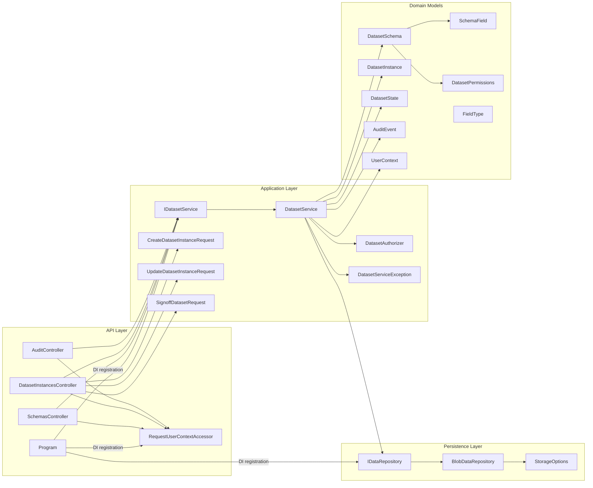
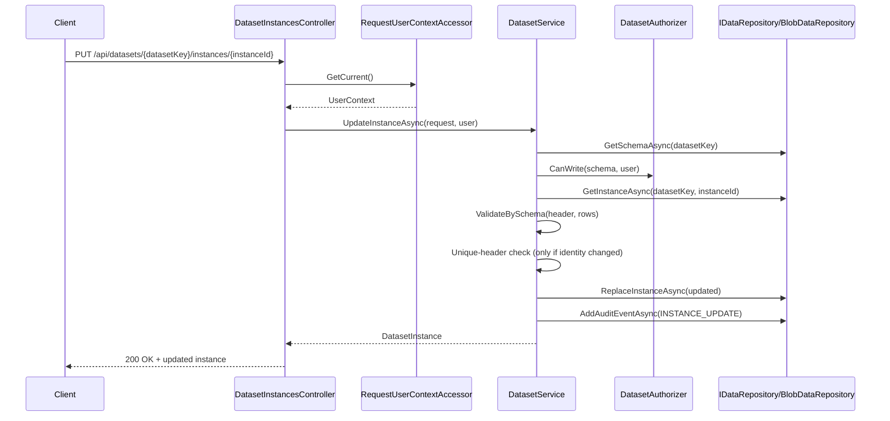
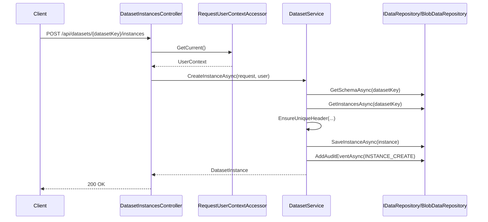
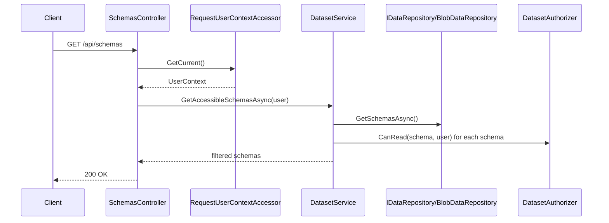

# Backend Class Interaction Map

This document summarizes how backend classes and interfaces interact in the `DatasetPlatform` backend.

## 1. Layered Structure

- **API Layer**
  - `Program`
  - `SchemasController`
  - `DatasetInstancesController`
  - `AuditController`
  - `RequestUserContextAccessor`
- **Application Layer**
  - `IDatasetService`
  - `DatasetService`
  - `DatasetAuthorizer`
  - `DatasetServiceException`
  - DTOs: `CreateDatasetInstanceRequest`, `UpdateDatasetInstanceRequest`, `SignoffDatasetRequest`
- **Persistence / Infrastructure Layer**
  - `IDataRepository`
  - `BlobDataRepository`
  - `StorageOptions`
- **Domain Layer**
  - `DatasetSchema`, `SchemaField`, `DatasetPermissions`
  - `DatasetInstance`, `DatasetState`
  - `AuditEvent`, `UserContext`, `FieldType`

## 2. Dependency Graph

## 3. Runtime Interaction Sequences

### 3.1 Save Existing Instance (Update)

### 3.2 Create New Instance

### 3.3 Read Schemas / Authorization

## 4. Key Interaction Notes

- Controllers are thin: they validate route/body consistency, resolve current user context, and delegate to `IDatasetService`.
- `DatasetService` is the orchestration core: authorization, validation, uniqueness checks, versioning, and audit event creation.
- `DatasetAuthorizer` centralizes role/user permission decisions.
- `IDataRepository` is the persistence abstraction; `BlobDataRepository` is the concrete JSON blob implementation (backed by local filesystem or S3).
- `RequestUserContextAccessor` builds `UserContext` from HTTP headers (`x-user-id`, `x-user-roles`).
- Domain models are shared contracts across API, application, and persistence layers.

## 5. Dependency Registration (Program)

- `IDatasetService` -> `DatasetService` (scoped)
- `IDataRepository` -> `BlobDataRepository` (singleton)
- `IRequestUserContextAccessor` -> `RequestUserContextAccessor` (scoped)

This wiring defines the runtime interaction chain used by all backend endpoints.
